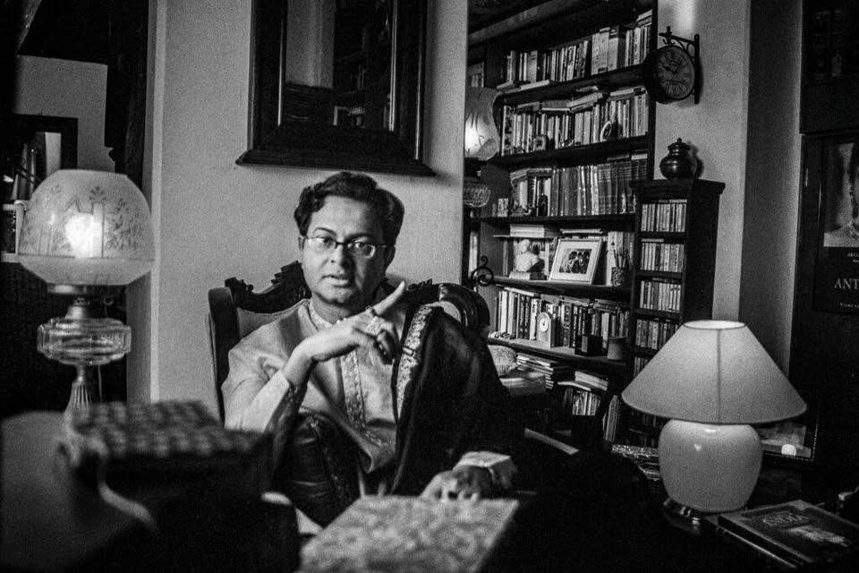

<div align="center">

<h1 style="font-family:'Amorisa','Playfair Display',Georgia,serif; font-weight:400; letter-spacing:2px; margin-bottom:4px;">🎬 RUDRA DA</h1>

<p style="font-family:'Okien','Inter',system-ui,sans-serif; font-size:1.1rem; margin-top:0;">
<em>A cinematic, monochrome tribute to the poet of Bengali cinema —</em> <strong>Rituparno Ghosh</strong>
</p>




</div>

---

## 🌟 About the Project

A single-page tribute website dedicated to **Rituparno Ghosh** — one of India's most celebrated film directors and screenwriters. The site is designed as a quiet, editorial, black-and-white museum of his life and work: a full-screen cinematic hero, his filmography, national awards, documentaries, and personal memories.

**The design language:** monochrome editorial aesthetic · Amorisa display typography · Okien UI type · smooth cinematic animations · fully responsive from phone to widescreen.

---

## ✨ Features

- 🎞️ **Full-screen cinematic hero** — striking portrait with an animated title reveal
- 🎥 **Netflix-inspired Creations section** — browse his films in a scrollable carousel
- 🏆 **Achievements timeline** — National Film Awards and honours
- 🎬 **Film detail modals** — click any film for more information
- 🎙️ **Documentaries** — his work beyond fiction
- 📷 **Memories gallery** — moments from his life
- 🖤 **Monochrome editorial aesthetic** — dark, minimal, timeless
- 📱 **Fully responsive** — polished on mobile and desktop
- ✨ **Silky animations** — Framer Motion page transitions & scroll effects

---

## 🛠️ Tech Stack

| Layer | Technology |
|------|------------|
| **Framework** | [TanStack Start](https://tanstack.com/start) (React 19 + SSR) |
| **Language** | TypeScript |
| **Build tool** | Vite |
| **Styling** | Tailwind CSS 4 + custom typography |
| **UI primitives** | shadcn/ui (Radix) |
| **Animation** | Framer Motion |
| **Routing** | TanStack Router |
| **Deployment** | Vercel |

---

## 🚀 Getting Started

```sh
git clone https://github.com/shohail-mahmud/rudra-da.git
cd rudra-da
npm install   # or: bun install
npm run dev
Open http://localhost:8080 — that's it.

Production build
Shell

npm run build
npm run preview
👨‍💻 Developed By
<div align="center"><h2 style="font-family:'Amorisa','Playfair Display',Georgia,serif; font-weight:400; letter-spacing:1px; margin-bottom:4px;">Shohail Mahmud</h2><p style="font-family:'Okien','Inter',system-ui,sans-serif; margin-top:0;"> <em>Bangladeshi Web Developer · AI-Assisted Builder · Vibe Coder</em> </p>
GitHub
Instagram
Gmail

Built with 🖤 for the memory of Rituparno Ghosh

</div>
<div align="center">
Made with Lovable · Preserved & shipped with care

</div> ```
